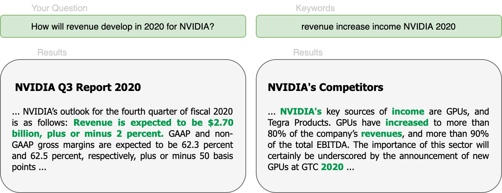

<!---
title: "What is Haystack"
metaTitle: "What is Haystack"
metaDescription: ""
slug: "/docs/intro"
date: "2020-09-03"
id: "intromd"
--->

# What is Haystack?

Haystack is an **open-source framework** for building **end-to-end question answering systems** for large document collections.
Recent advances in NLP have enabled the application of QA to real world settings
and Haystack is designed to be the bridge between research and industry.

* **Latest NLP models**: Utilize all transformer based models (BERT, RoBERTa, MiniLM, DPR ...) and smoothly switch when new ones get published

* **Flexible databases**: Load data into and query from a range of databases such as Elasticsearch, FAISS, SQL and more

* **Scalability**: Production-ready deployments that scale to millions of documents

* **End-to-End**: All tooling you need to implement, evaluate, improve and run a QA system

* **Domain adaptation**: Fine-tune models to your own domain & improve them continuously via user feedback

## Use cases

### Semantic Search System

Take the leap from using keyword search on your own documents to semantic search with Haystack.

* Store your documents in the database of your choice (Elasticsearch, SQL, in memory, FAISS)

* Perform question driven queries.

Expect to see results that highlight the very sentence that contains the answer to your question.
Thanks to the power of Transformer based language models, results are chosen based on compatibility in meaning
rather than lexical overlap.

### Information Extractor

Automate the extraction of relevant information from a set of documents that pertain to the same topics but for different entities.

Haystack can:

* Apply a set of standard questions to each document in a store

* Return a NO_ANSWER if a given document does not contain the answer to a question

Say you have the financial reports for different companies over different years.
You can gather a set of standard questions which are applicable to each financial report,
like *what is the revenue forecast for 2020?* or *what are the main sources of income?*.
Haystack will try to find an answer for each question within each document!

We’ve seen this style of application be particularly effective in the sphere of finance and patent law
but we see a lot of potential in using this to gain a better overview of academic papers and internal business documents.

<!-- _comment: !!Image!! -->
### FAQ Style Question Answering

Leverage existing FAQ documents and semantic similarity search to answer new incoming questions.
The workflow is as follows:

* Store a set of FAQ documents in Haystack

* The user presents a new question

* Haystack will find the closest match to the new question in the FAQ documents

* The user will be presented with the most similar Question Answer pair

Haystack’s flexibility allows you to give new users more dynamic access to your existing documentation.

<!-- _comment: !!Image!! -->
## Technology

Haystack is powered by a Retriever-Reader pipeline in order to optimise for both speed and accuracy.

**Readers**, also known as Open-Domain QA systems in Machine Learning speak,
are powerful models that do close analysis of documents and perform the core task of question answering.
The Readers in Haystack are trained from the latest transformer based language models and can be significantly sped up using GPU acceleration.
However, it is not currently feasible to use the Reader directly on large collection of documents.

<!-- _comment: !! benchmarks link !! -->
<!-- _comment: !! Image of What a reader does and maybe architecture !! -->
The **Retriever** assists the Reader by acting as a lightweight filter that reduces the number of documents that the Reader has to process.
It does this by:

* Scanning through all documents in the database

* Quickly identifying the relevant and dismissing the irrelevant

* Passing on only a small candidate set of documents to the Reader

Current methods fall into one of the two categories:

* sparse
        * keyword based
        * fast indexing and querying
        * e.g. BM25

* dense
        * neural network based
        * computationally heavy indexing but fast querying
        * e.g. Dense Passage Retrieval
